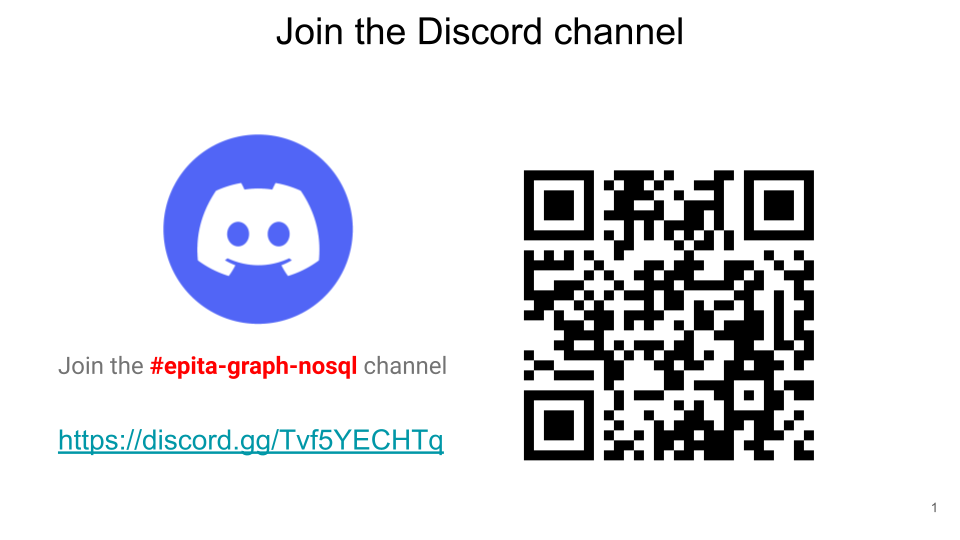

- [S01 course welcome and logistics](#s01-course-welcome-and-logistics)
  - [Welcome](#welcome)
  - [Course scope](#course-scope)
  - [How we work](#how-we-work)
    - [Know your laptop](#know-your-laptop)
  - [Logistics](#logistics)
    - [Discord](#discord)
    - [Github](#github)
    - [LLMs](#llms)
  - [Evaluation](#evaluation)
  - [Today](#today)

# S01 course welcome and logistics

## Welcome

I'm Alexis Perrier
I'm super excited to work with you on these fantastic databases that are MongoDB and Neo4j.

Connect on :

- Linkedin: https://www.linkedin.com/in/alexisperrier/
- Bluesky: @alexisperrier.bsky.social
- Mastodon: https://sigmoid.social/@alexisperrier
- Email: alexis.perrier@epita.fr

If you've only worked with SQL database such as PostgreSQL, you will be amazed or at least intrigued.

## Course scope

This is a course on MongoDB and Neo4j.

- **MongoDB** is a NoSQL database that promises to excel with _high volume_ databases that have _flexible data_ structures.
- **Neo4J** is a graph database that is particularly efficient for certain types of use cases and questions - knowledge graphs.

And we have a new kid in town: **Vector Search**! Vector search is the building block of LLMs.

All the major players now offer vector search, including PostgreSQL, MongoDB and Neo4J. Dedicated Vector databases such as Weaviate, Pinecone, ... have also come into light although they've been around for some time. So we will dedicate one session to work with vector search.

We have 6 sessions together, 3h hours each. Not a lot of time to cover such big topics / tools.

The course plan is:

- 2 sessions on MongoDB
- 1 session on vector search
- 3 sessions on Neo4j

## How we work

This course is as much as possible **hands-on** with a "learning by doing" approach.

Since this is an advanced course and we don't have much time. We will try not to focus too much on the query language specific to these platforms. Although we will have our share of querying. But you can all learn a new querying language pretty fast.

We will focus on the **why** on top of the **how**.

Each session consists of 50% (or more) of you working on a lab or project and 50% (or less) of me talking.

### Know your laptop

I assume you have a solid base in python or some other similar language, and that you are experienced with at least on SQL database.

I also expect you to find your way around your laptop. For instance you can spin up a terminal and modify the PATH.

If python is not your thing and you prefer another language to work with (Go, javascript, PHP, tcl/tk, Java, ...) please do so.

This is a course on databases not on scripting languages. But many examples will be based on either the database command line tool (`mongosh`, `cypher shell`) or python 3 and `pymongo`.

## Logistics

### Discord

We have a discord channel dedicated to the course.

<https://discord.gg/Tvf5YECHTq>

Hop in the #epita-graph-nosql channel and say hello.

You can contact me directly on the discord either directly or in the server anytime for questions.

### Github

And the course is on Github.

You can find the course material in the `/docs` folder.

<https://github.com/SkatAI/epita-nosql-mongodb>

The course is a work in progress. I will update the content over the 3 weeks.

### LLMs

The use of ChatGPT and other LLMs is allowed.

It would be absurd to not use these tools.

But it's important to understand how to use them in a learning context.

Working with an LLM can be tricky, frustrating and a waste of time.  We will experiment together how to make the most of *"AI"*.

But the main principle is that you don't get fit by watching people workout at the gym.

You can't learn by letting the LLM do the work.

## Evaluation

If you come to class and try your best to get the work done, you do not have to worry about the grade.

Evaluation will be throughout the course with:

- lab work / worksheets
- A final quiz that covers the course. no tricks.

But please come and if possible be on time.

## Today

We start with a global high overview of databases and then dive into MongoDB.

But first let's do the `getting to know you` questionnaire

<https://quiz.skatai.com/quiz/welcome-questionnaire-for-epita-graph-nosql-course>

